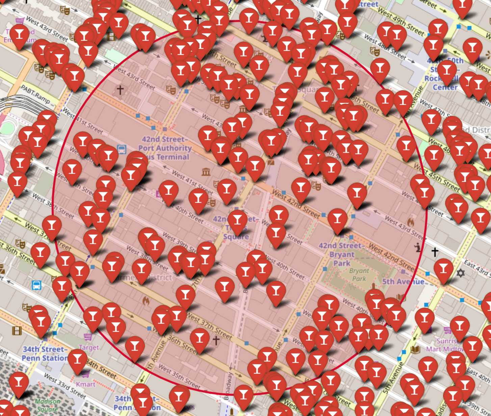
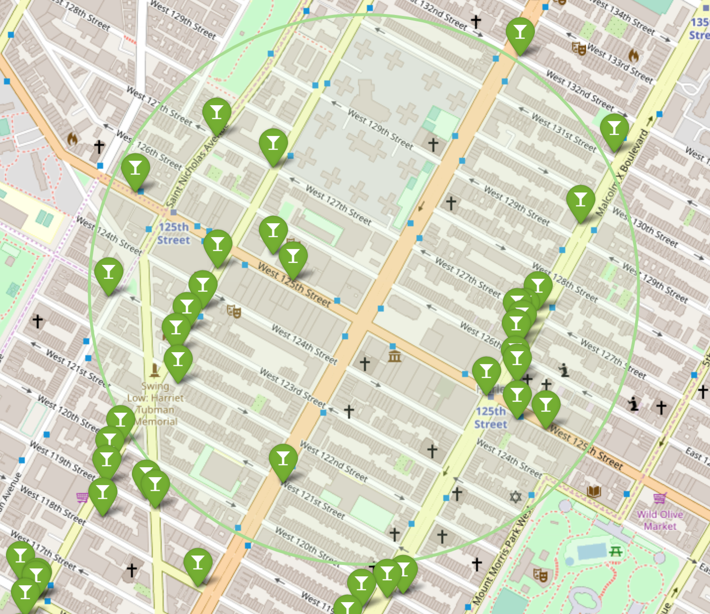
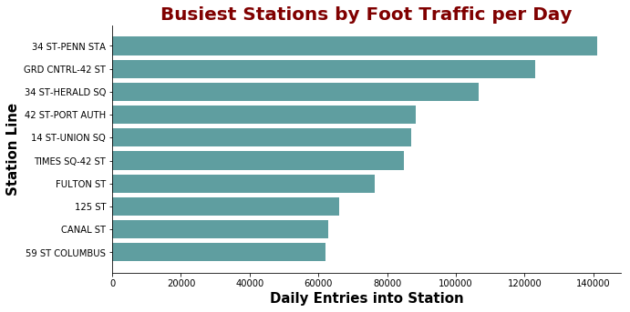
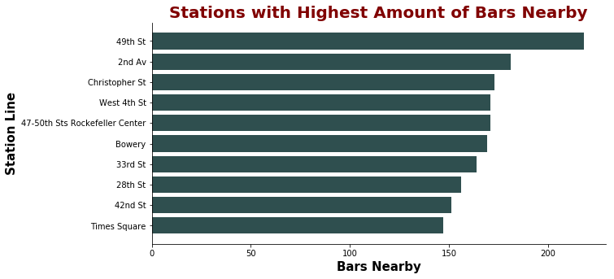
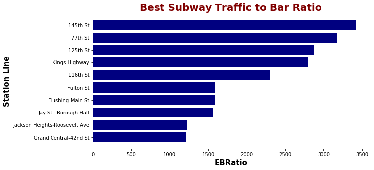

{
 "cells": [
  {
   "cell_type": "markdown",
   "metadata": {},
   "source": [
    "# MTA Turnstile EDA and Bar Location Recommendation\n",
    "\n",
    "The main idea for this project was explatory data analysis of subway MTA turnstile data. After cleaning, sorting, and analyzing this data, we then used this data combined with data we scraped and cleaned from the NYC.gov website for liquor licenses and created ratios for foot traffic by station and number of bars within a 0.5 kilometer radius around the station. The idea is to find stations with the most foot traffic but with the least amount of competition from other bars in the area."
   ]
  },
  {
   "cell_type": "markdown",
   "metadata": {},
   "source": [
    "## Getting Started\n",
    "\n",
    "\n",
    "mta_data.ipynb has the bulk of the code necessary for the MTA turnstile data portion of the project. If each cell is run in order, it will pull the data, clean it (which is a majority of the project since the data is rather messy), and sorts and analyzes it.\n",
    "\n",
    "Once this is done, mta_barproximityranking.ipynb pulls the data for the liquor licenses, cleans it, and combines it with our earlier data from mta_data.ipynb to create our ratios of foot-traffic to bars within a certain radius of a subway station."
   ]
  },
  {
   "cell_type": "markdown",
   "metadata": {},
   "source": [
    "### Prerequisites\n",
    "\n",
    "(What things you need to install the software and how to install them)\n",
    "Mainly, just the basics are necessary as prerequisites such as pandas, etc.\n",
    "\n",
    "```\n",
    "import numpy as np\n",
    "import pandas as pd\n",
    "import seaborn as sns\n",
    "import matplotlib.pyplot as plt\n",
    "```\n",
    "Additionally, we used folium to map out bars as pins with the radius around them to show the density of bars around certain stations.\n",
    "\n",
    "EX. Bars around Times Square and 42nd Station (Bad foot traffic to bar density)\n",
    "\n",
    "\n",
    "EX. Bars around 125th Station (Good foot traffic to bar density)\n",
    ""
   ]
  },
  {
   "cell_type": "markdown",
   "metadata": {},
   "source": [
    "### Installing\n",
    "\n",
    "This should be relatively unecessary since these are common libraries, but if these need to be installed,\n",
    "\n",
    "```\n",
    "pip install numpy\n",
    "pip install matplotlib\n",
    "pip install pandas\n",
    "pip install seaborn\n",
    "```\n",
    "conversely, these can be installed via anacondas as well,\n",
    "\n",
    "```\n",
    "conda install numpy,\n",
    "etc.\n",
    "```\n",
    "\n",
    "This is all run on Python3 within Jupyter Notebooks"
   ]
  },
  {
   "cell_type": "markdown",
   "metadata": {},
   "source": [
    "## Running the tests\n",
    "\n",
    "Since this is all within ipython and jupyter notebooks, you can run full_mta_complete.ipynb and run each cell. You should end up with pandas dataframes and visualization charts of top stations with highest ratio of foot traffic to bars in the area.\n",
    "\n",
    "\n",
    "EX. Busiest stations in NYC\n",
    "\n",
    "\n",
    "EX. Stations with the most bars nearby\n",
    "\n",
    "\n",
    "EX. Busiest locations with least bars\n",
    ""
   ]
  },
  {
   "cell_type": "markdown",
   "metadata": {},
   "source": [
    "## Built With\n",
    "\n",
    "* [Folium](https://pypi.org/project/folium/) - Geographic visualization library\n",
    "* [Matplotlib](https://matplotlib.org/) - Visualization library\n",
    "* [Seaborn](https://seaborn.pydata.org/) - Visualization library"
   ]
  },
  {
   "cell_type": "markdown",
   "metadata": {},
   "source": [
    "## Authors\n",
    "\n",
    "* **Christian Branton** \n",
    "* **Lukas Wadya** \n",
    "* **Phillip Beltre** \n",
    "* **James Mitchell**\n",
    "\n",
    "[Metis](https://github.com/thisismetis)"
   ]
  },
  {
   "cell_type": "markdown",
   "metadata": {},
   "source": [
    "## Acknowledgments\n",
    "\n",
    "* Thanks to my team members for this project\n",
    "* And a big thanks to Metis for making all this possible"
   ]
  }
 ],
 "metadata": {
  "kernelspec": {
   "display_name": "Python 3",
   "language": "python",
   "name": "python3"
  },
  "language_info": {
   "codemirror_mode": {
    "name": "ipython",
    "version": 3
   },
   "file_extension": ".py",
   "mimetype": "text/x-python",
   "name": "python",
   "nbconvert_exporter": "python",
   "pygments_lexer": "ipython3",
   "version": "3.7.1"
  }
 },
 "nbformat": 4,
 "nbformat_minor": 2
}
